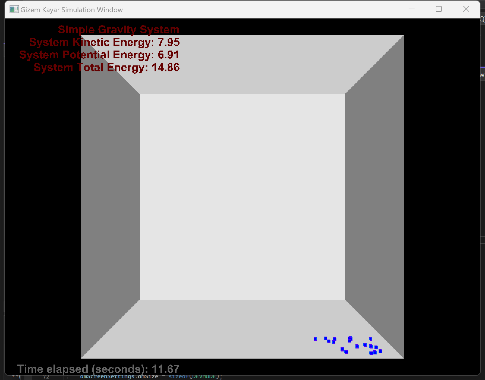

CG homework 3
======================================
Name: Scott Fan

I used visual studio community 2022 for this assignment. 
All environments are set according to HW3-simulation.pdf.

### How to run

To see my results, click exe_results folder, find .exe files for both part 1 and part 2

##### Part 1

Compile simulation.cpp to generate the result for part1.

##### Part 2

Compile simulation.cpp to generate the result for part2.

Part 1 Code Description:
-----------------

### Task 1

In this part, you are expected to implement Euler and Euler Cromer methods. The first thing you need is 
taking the current value of position and velocity, then update them according to corresponding scheme 
and set the position and velocity of the particle with new values.

```
void Simulation::simulateEuler(Particle* p)
{
	//TO DO
	p->setPosition(p->getPosition() + p->getVelocity() * this->timestep);
	p->setVelocity(p->getVelocity() + p->getForce() * this->timestep / this->commonMass);
}
```
```
void Simulation::simulateEulerCromer(Particle* p)
{
	//TO DO
	p->setVelocity(p->getVelocity() + p->getForce() * this->timestep / this->commonMass);
	p->setPosition(p->getPosition() + p->getVelocity() * this->timestep);

}
```
```
void Simulation::simulateVerlet(Particle* p)
{
	//TO DO
	p->setPosition(p->getPosition() + p->getVelocity() * this->timestep + p->getForce() * (this->timestep * this->timestep) / (2 * this->commonMass));
	p->setVelocity(p->getVelocity() + p->getForce() * this->timestep / this->commonMass);

}
```
### Task 2

In the second part, you are expected to compute system energies. So, traverse along the particle list, and 
update kinetic and potential energy accordingly. 

```
void Simulation::computeSystemEnergies()
{
	//TO DO
	this->kinEn = 0.0f;
	this->potEn = 0.0f;

	vector3f gravity(0.0f, -9.81f, 0.0f);
	for (int i = 0; i < noPt; i++)
	{
		Particle p = particleList[i];
		this->kinEn += (this->commonMass * p.getVelocity().lengthSquare()) / 2;

		this->potEn += (9.81f * (this->commonMass) * (p.getPosition().getY() + this->halfWorld.getY()));
	}

}
```

### Task 3

Try your system with different integration schemes and with different number of particles. Does energy 
computation result give an idea about the schemes’ stability? Discuss

Answer: If the total energy remains relatively constant throughout the simulation, it indicates that the numerical scheme used for the simulation is stable and conserves energy.


Part 2 Code Description
----------------------

### task 1

In this part, you are expected to apply forces to particles and springs appropriately (in Simulation.h). First 
of all, traverse along the particles and apply gravity to all of them. Later, traverse along the spring list and 
apply spring and damping forces. Please check Hooke’s Law and damping forces

### task 2

In the second part of the homework, you are expected to compute system energies (in Simulation.cpp). 
First of all, traverse along the particle list, update kinetic and potential energy accordingly which is similar 
to your first programming assignment. Later, traverse along the spring list and compute total spring 
energy of the system.

```
void Simulation::computeSystemEnergies()
{
	kinEn = 0.0f;
	potEn = 0.0f;
	sprEn = 0.0f;

	//TO DO - Compute kinetic and potential energy
	
	for (int i = 0; i < mesh.particles.size(); i++)
	{
		Particle p = mesh.particles[i];
		this->kinEn += (this->commonMass * p.getVelocity().lengthSquare()) / 2;
		this->potEn += (9.81f * (this->commonMass) * (p.getPosition().getY() + this->halfWorld.getY()));
	}

	//TO DO - Compute spring energy
	for (int s = 0; s < mesh.springs.size(); s++)
	{
		vector3f p1Position = mesh.particles[mesh.springs[s].p1].getPosition();
		vector3f p2Position = mesh.particles[mesh.springs[s].p2].getPosition();
		float distance = sqrtf(pow(p1Position.getX() - p2Position.getX(), 2) + pow(p1Position.getY() - p2Position.getY(), 2) + pow(p1Position.getZ() - p2Position.getZ(), 2)) - mesh.springs[s].initLength;
		this->sprEn += (spring_constant* distance* distance) / 2;
	}
}
```

### task 3

Try your system with different integration schemes, increase/decrease spring and damping constants (in 
Simulation.h). What kind of behavior you observed with different setup? Discuss the results.
1. Stiffer springs and lower damping constants can lead to more oscillations and potentially unstable behavior.
2. Softer springs and higher damping constants can result in slower oscillations and increased stability.
3. The choice of integration scheme can significantly impact the stability and accuracy of the simulation. More advanced methods like Verlet or Runge-Kutta may provide better performance, especially for stiffer systems or larger time steps.

### Result

Here are two images for both part 1 and part 2:




